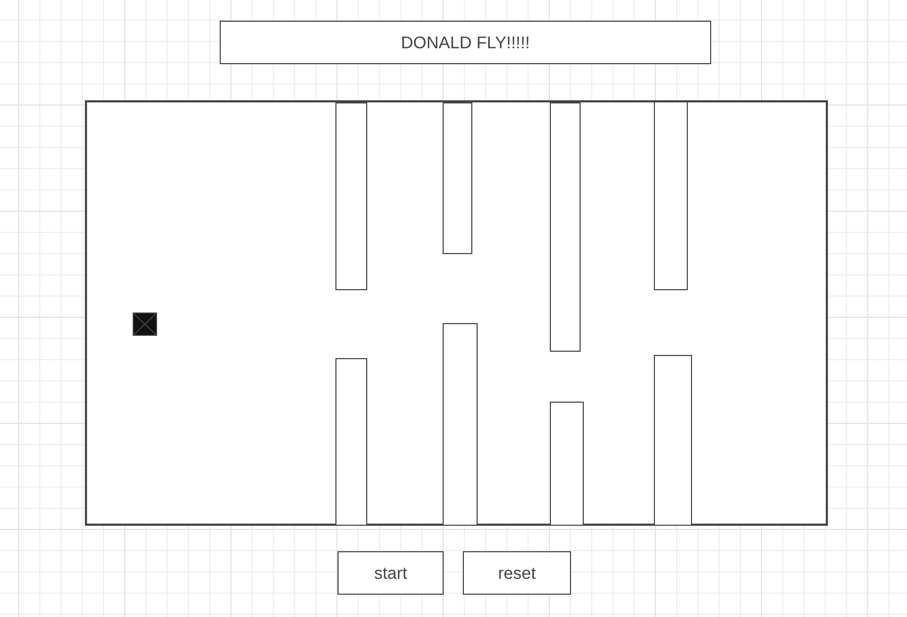

# Donald Trump fly

#wireframe

In the game, the goal is to keep Donald trump flying by not hit Nancy Pelosi by using the W, A, S, D keys. In the game if Donald Trump hits a oject the word impeached will appear . Game is going to be similar to flappy bird
### How to move
		-W = up
		-A = left
		-S = down
		-D = right

# Tech
    - The tech that I used:
        1. html
        2. css
        3.javascript 

# MVP
    -My mvp was:
        1. get a board game on the screen with Html and css
        2. make a start button 
        3. have donalds face on the game board flying 
        4. have some type of obsticle for donald to fly through

# Stretch Goals 
    -Things to add if i have time 
        1. reset button
        2. set a timer for 20 sec and if time goes by and Donald is still flying have the words president appear on the screen.
        3. add the pictures of nancy pelosi
        4. add music
        4. add more styling 
       
# Bugs/Obstacles
My biggest obstacle was trying to figure out why my main character was not being detected by the bottom pipes. Over the collision detection was really complicated.

# External sources 
    1. Youtube
    2. W3Schools
    3. Mozilla 